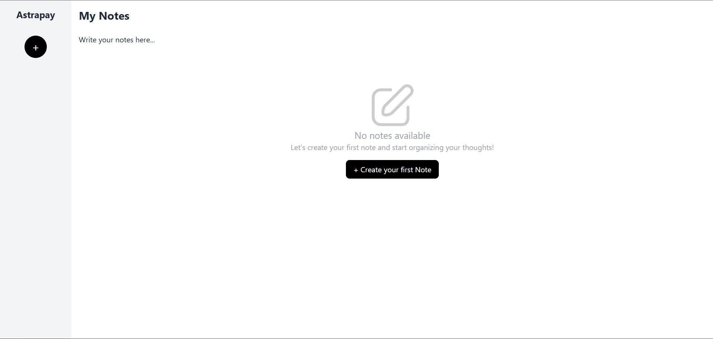
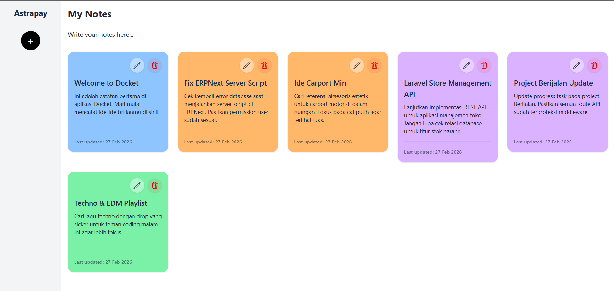
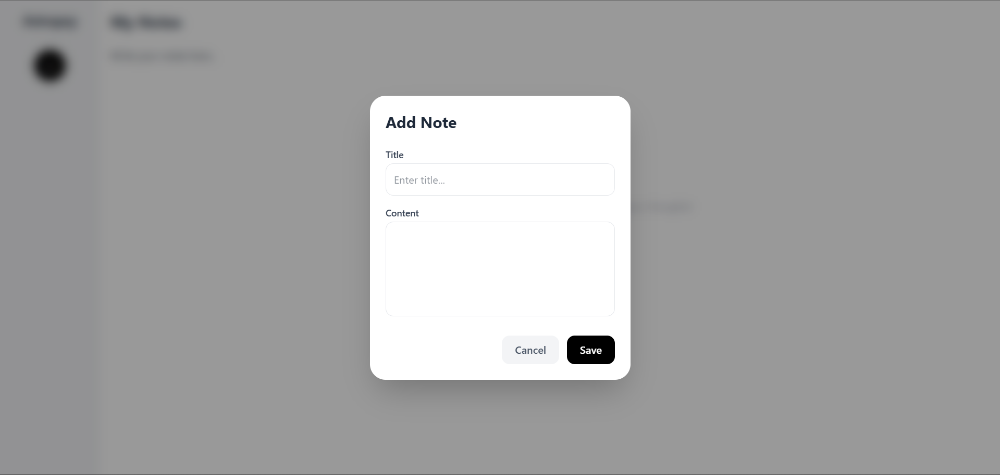
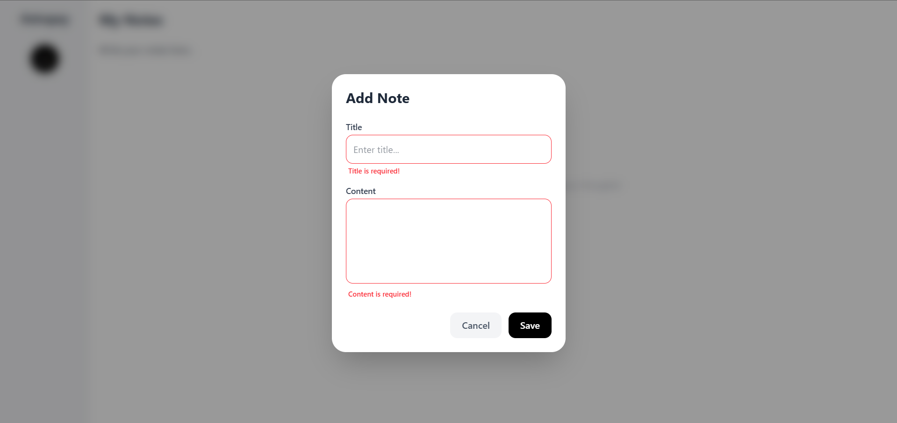
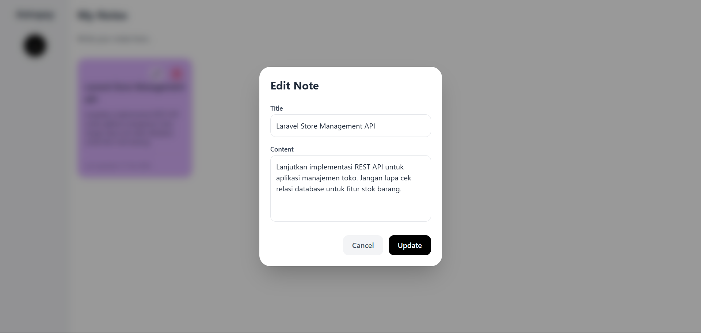

# Astrapay Project Challenge FE - Simple Note Apps with Angular

This project was generated with [Angular CLI](https://github.com/angular/angular-cli) version 17.3.17.

## Prerequisites
- Node.js (v18 or higher)
- Npm include with Node.JS
- Angular 17 +
- Git

## Quick Start
1. Clone the Repository
```
https://github.com/Kusumojakti/astrapay-projectchallenge-noteapps-fe.git
cd astrapay-projectchallenge-noteapps-fe
```
2. Build application
```
npm install
```
3. Run the Application
```
ng serve
```
4. Running the Application
- After run success, the application will active on `http://localhost:4200/`

## Application Features
- View and Read Notes with responsive grid
- Create and Update Notes
- Delete unused notes
- Responsive design to makesure apps still run well on dekstop or mobile
- Simple Validation
- Error Handling

## Testing
Run Unit Test:
```
ng test
```

## Form Validation
- Title and Content must be fill before it save
- Giving maximum lenght on title and content form

## Preview 
**Empty State**



**View Notes**



**Create New Notes**



**Create New Notes Validation**



**Edit New Notes**



## Further help

To get more help on the Angular CLI use `ng help` or go check out the [Angular CLI Overview and Command Reference](https://angular.io/cli) page.

Thank you and Happy Coding!
